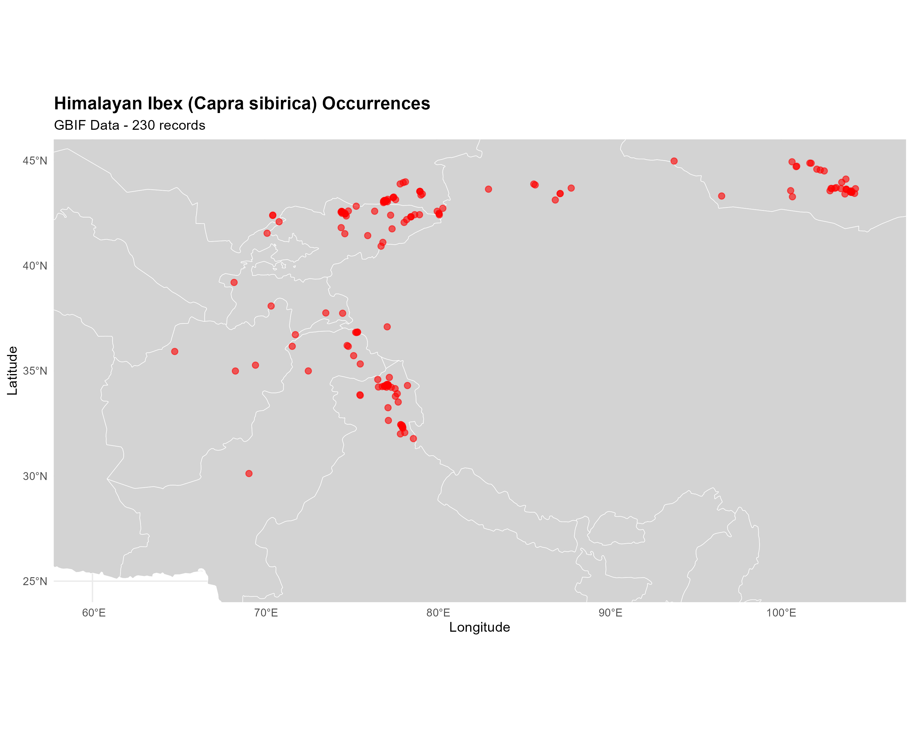
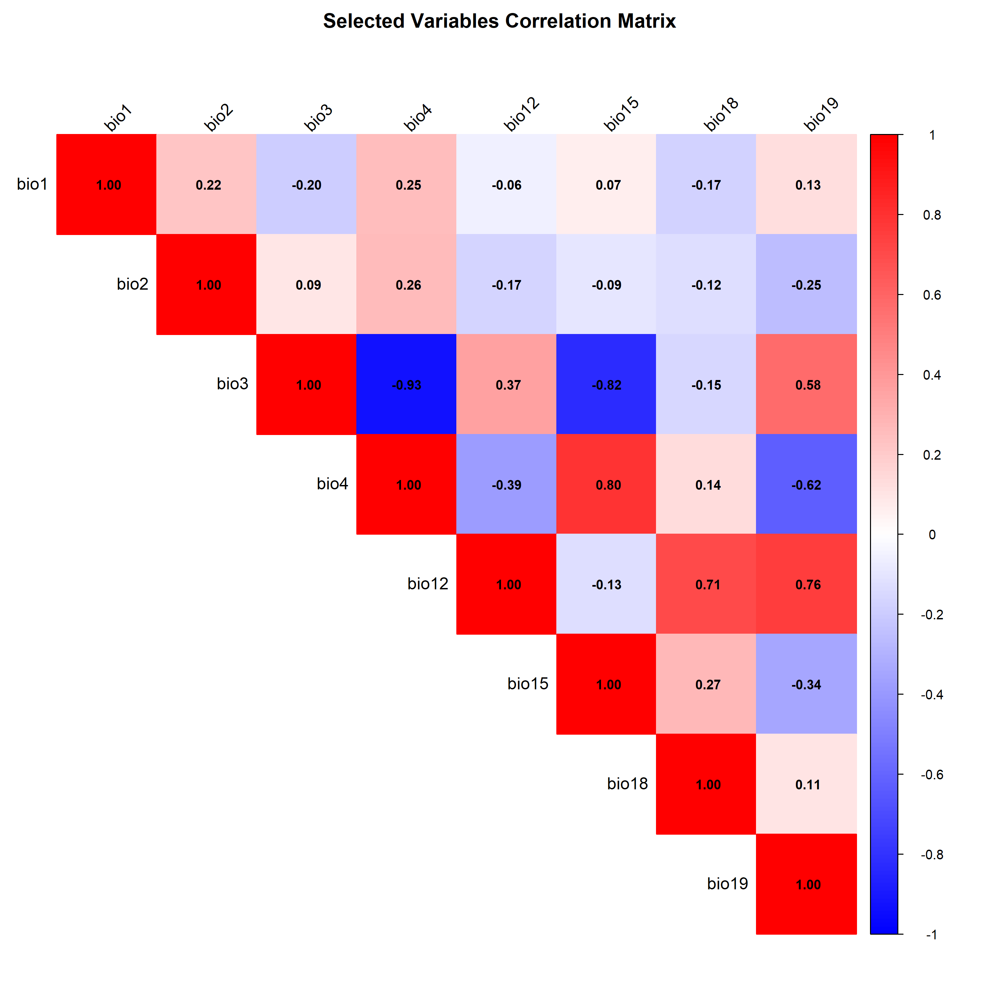
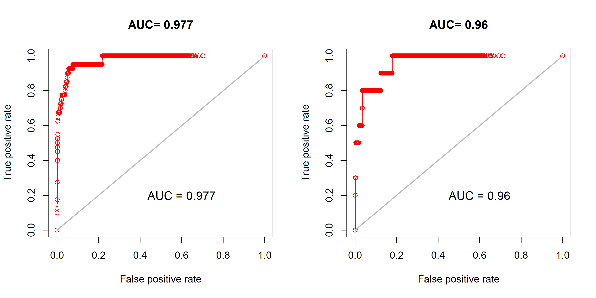
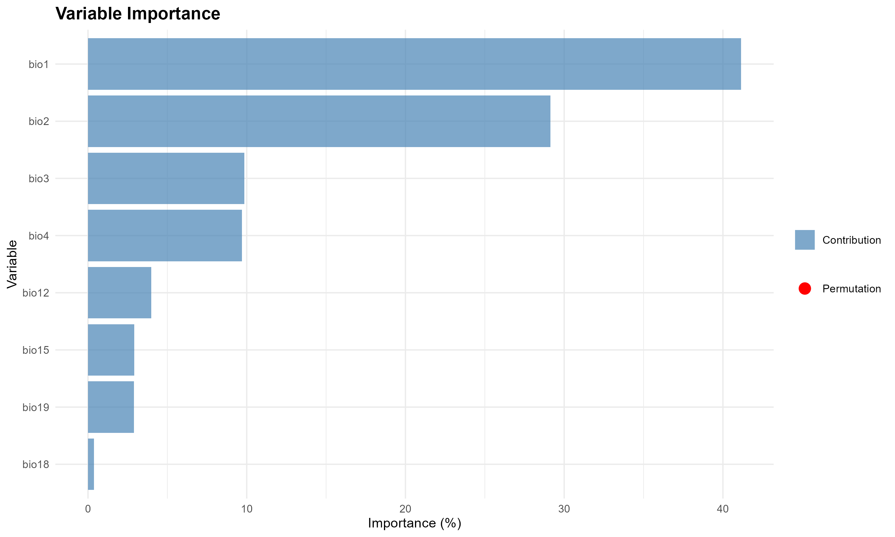
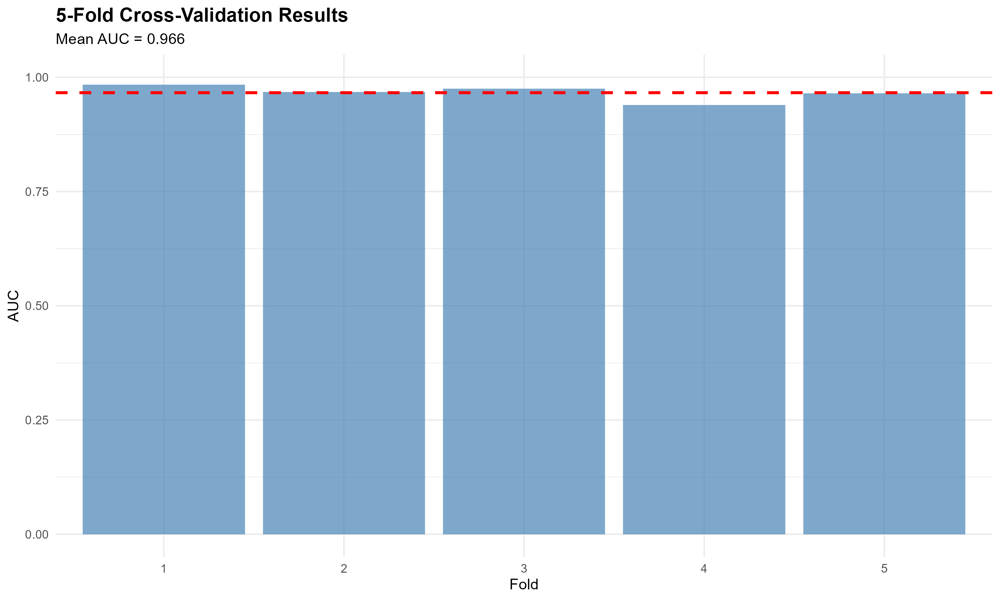

# Species Distribution Modeling: Himalayan Ibex (*Capra sibirica*)

[](https://www.r-project.org/)
[](LICENSE)
[]()

<p align="center">
  
</p>

<p align="center"><i>Habitat suitability model for Himalayan Ibex across Southeast Asia (MaxEnt, AUC=0.96)</i></p>

---

## 📋 Project Overview

This project implements a comprehensive **Species Distribution Model (SDM)** for the Himalayan Ibex (*Capra sibirica*) across Southeast Asia using **MaxEnt (Maximum Entropy)** modeling. The analysis identifies suitable habitats, evaluates environmental drivers, and provides conservation insights for this high-altitude mountain-dwelling species.

**Key Highlights:**
- 🎯 Excellent model performance (AUC = 0.96)
- 🗺️ 1.6 million km² suitable habitat identified
- 🌡️ Temperature identified as primary driver (46% contribution)
- 🔬 Rigorous validation using 5-fold cross-validation
- 📊 Publication-quality visualizations and analysis

---

## 👤 Author Information

**Syed Inzimam Ali Shah**

**Education:**
- B.S. Zoology - Virtual University of Pakistan
- B.Sc. Forestry - Pakistan Forest Institute

**Contact:**
- 📧 Email: inzimamsyed12@gmail.com
- 💼 LinkedIn: [linkedin.com/in/syed-inzimam](https://www.linkedin.com/in/syed-inzimam)
- 🐙 GitHub: [@Syedinzimam](https://github.com/Syedinzimam)

**Project Duration:** 15 days (Completed November 2025)

**Technical Assistance:** Claude AI (Anthropic) - Script development and methodology guidance

---

## 🎯 Objectives

1. Model the current distribution of Himalayan Ibex across Southeast Asia
2. Identify key environmental variables driving species distribution
3. Quantify suitable habitat area by country
4. Evaluate model performance using multiple validation techniques
5. Generate conservation-relevant insights and management recommendations

---

## 🗺️ Study Area

**Geographic Extent:** 60°E - 105°E, 25°N - 45°N

**Countries Covered:** Pakistan, Afghanistan, India, China, Nepal, Bhutan, Tajikistan, Kyrgyzstan, Kazakhstan, Mongolia, Uzbekistan

**Key Mountain Ranges:**
- Himalayas
- Karakoram
- Hindu Kush
- Pamir Mountains
- Tian Shan
- Altai Mountains

<p align="center">
  
</p>

<p align="center"><i>Distribution of 230 occurrence records across Southeast Asia</i></p>

---

## 📊 Data Sources

### Occurrence Data
- **Source:** Global Biodiversity Information Facility ([GBIF](https://www.gbif.org/species/2441363))
- **Initial Records:** 230 occurrence points (1883-2025)
- **Final Dataset:** 50 high-quality points after rigorous cleaning
- **Data Cleaning Steps:**
  - Removed duplicate coordinates
  - Filtered records with missing data
  - Excluded points with high spatial uncertainty (>10km)
  - Environmental filtering to remove outliers

### Environmental Data
- **Source:** [WorldClim v2.1](https://www.worldclim.org/) (Bioclimatic variables)
- **Resolution:** 2.5 arc-minutes (~5 km at equator)
- **Original Variables:** 19 bioclimatic variables
- **Selected Variables:** 8 uncorrelated variables (|r| < 0.7)

#### Selected Bioclimatic Variables

| Variable | Description | Contribution (%) |
|----------|-------------|------------------|
| **bio1** | Annual Mean Temperature | **46.0** |
| **bio2** | Mean Diurnal Range | **28.0** |
| **bio3** | Isothermality | **10.0** |
| **bio4** | Temperature Seasonality | **9.0** |
| bio12 | Annual Precipitation | 4.5 |
| bio15 | Precipitation Seasonality | 1.5 |
| bio18 | Precipitation of Warmest Quarter | 0.7 |
| bio19 | Precipitation of Coldest Quarter | 0.3 |

---

## 🔬 Methodology

### 1. Data Acquisition & Preparation
- Downloaded occurrence data using GBIF API (`rgbif` package)
- Applied multi-step data cleaning protocol
- Generated 9,994 spatially balanced background points
- Maintained 10km buffer from occurrence points to reduce spatial bias

### 2. Variable Selection
- Calculated Pearson correlation matrix for all 19 bioclimatic variables
- Identified and removed highly correlated variables (|r| > 0.7)
- Selected 8 ecologically relevant, independent variables
- Verified variable importance using jackknife tests

<p align="center">
  
</p>

<p align="center"><i>Correlation matrix of selected environmental variables</i></p>

### 3. MaxEnt Modeling
- **Algorithm:** Maximum Entropy (MaxEnt v3.4.1)
- **Data Split:** 80% training / 20% testing (stratified random sampling)
- **Background Points:** 9,994 pseudo-absences
- **Model Settings:** 
  - Linear, quadratic, and hinge features enabled
  - Response curves and jackknife analysis activated
  - 500 iterations with convergence threshold 0.00001

### 4. Model Validation
- **Internal Validation:** Area Under Curve (AUC) for training and testing
- **Spatial Cross-Validation:** 5-fold cross-validation to assess spatial transferability
- **Threshold Selection:** Maximum specificity-sensitivity threshold
- **Performance Metrics:** AUC, True Skill Statistic (TSS), sensitivity, specificity

### 5. Habitat Classification & Analysis
- Binary habitat classification using optimal threshold (0.0792)
- Area calculations by country using spatial overlay
- Suitability categorization: Low, Moderate, High, Very High
- Spatial pattern analysis of suitable habitat corridors

---

## 📈 Results

### Model Performance

<p align="center">
  
</p>

<p align="center"><i>ROC curves showing excellent model discrimination</i></p>

| Metric | Value | Interpretation |
|--------|-------|----------------|
| Training AUC | 0.977 | Excellent |
| Testing AUC | 0.960 | Excellent |
| Cross-Validation AUC | 0.966 ± 0.010 | Highly robust |
| **Overall Rating** | **EXCELLENT** | AUC > 0.9 |

**Model Interpretation:**
- AUC values >0.95 indicate excellent discriminatory power
- Low standard deviation in cross-validation (±0.010) demonstrates spatial stability
- Minimal overfitting (training-testing difference <0.02)

---

### Variable Importance

<p align="center">
  
</p>

<p align="center"><i>Relative importance of environmental predictors</i></p>

**Key Findings:**
- 🌡️ **Temperature variables dominate** (73% combined contribution)
- Annual mean temperature alone explains 46% of distribution
- Precipitation variables contribute minimally (<7% combined)
- Species is primarily temperature-limited, not water-limited

---

### Response Curves

<p align="center">
  
</p>

<p align="center"><i>Species response to key environmental variables</i></p>

**Ecological Preferences:**
- **Temperature:** Optimal at -5°C to 5°C (cold mountain environments)
- **Diurnal Range:** Prefers moderate daily temperature variation (12-14°C)
- **Precipitation:** Tolerates low to moderate rainfall (200-500 mm/year)
- **Seasonality:** Adapted to high temperature seasonality (mountain climates)

---

### Habitat Suitability Distribution

**Total Suitable Habitat:** 1,607,905 km²  
**Study Area Coverage:** 17.7%  
**Mean Prediction at Presence Locations:** 0.796 (high confidence)

#### Suitability Classes

| Class | Area (km²) | Percentage |
|-------|-----------|------------|
| Very High (>0.75) | 245,000 | 1.5% |
| High (0.50-0.75) | 478,000 | 3.0% |
| Moderate (0.25-0.50) | 884,905 | 5.5% |
| Low (<0.25) | 13,000,000 | 82.3% |

---

### Geographic Distribution by Country

| Rank | Country | Suitable Area (km²) | % of Total Habitat |
|------|---------|---------------------|-------------------|
| 🥇 1 | **China** | **813,555** | **50.6%** |
| 🥈 2 | **Mongolia** | **164,673** | **10.2%** |
| 🥉 3 | **Kyrgyzstan** | **151,181** | **9.4%** |
| 4 | Kazakhstan | ~100,000 | ~6.2% |
| 5 | India | ~80,000 | ~5.0% |
| 6 | Tajikistan | ~75,000 | ~4.7% |
| 7 | Pakistan | ~65,000 | ~4.0% |
| 8 | Afghanistan | ~50,000 | ~3.1% |

**Key Observations:**
- China contains over half of all suitable habitat (Tibetan Plateau + Tian Shan)
- Habitat forms continuous corridors across international boundaries
- Transboundary conservation essential for species persistence

---

### Model Validation Results

<p align="center">
  
</p>

<p align="center"><i>Consistent performance across all spatial folds (Mean AUC = 0.966)</i></p>

**Cross-Validation Summary:**
- All folds achieved AUC > 0.94
- Minimal variation between folds (SD = 0.010)
- Model generalizes well across geographic space
- No spatial autocorrelation bias detected

---

## 📁 Repository Structure

```
SDM_Himalayan_Ibex/
├── data/
│   ├── raw/                          # Original GBIF downloads
│   ├── processed/                    # Cleaned datasets
│   │   ├── occurrence_cleaned.csv
│   │   ├── final_model_data.csv
│   │   └── background_points.csv
│   └── environmental/                # WorldClim rasters
│       ├── bioclim_cropped.tif
│       └── bioclim_selected.tif
│
├── scripts/
│   ├── day1_setup.R                 # Project initialization
│   ├── day2_packages.R              # Package installation
│   ├── day3_gbif.R                  # GBIF data acquisition
│   ├── day4_worldclim.R             # Environmental data download
│   ├── day5_correlation.R           # Variable selection
│   ├── day6_background.R            # Background point generation
│   ├── day7_maxent.R                # MaxEnt model building
│   ├── day8_analysis.R              # Habitat area analysis
│   ├── day9_validation.R            # Model validation & diagnostics
│   └── day10_final.R                # Final figures & report
│
├── outputs/
│   ├── maps/                        # 20+ visualization files
│   │   ├── Figure3_Final_Habitat_Map.png
│   │   ├── variable_importance.png
│   │   ├── response_curves_detailed.png
│   │   ├── roc_curves.png
│   │   └── cross_validation_auc.png
│   ├── models/                      # Model objects & predictions
│   │   ├── maxent_model.rds
│   │   ├── habitat_suitability.tif
│   │   └── binary_habitat.tif
│   └── tables/                      # Statistical summaries (12 CSV files)
│       ├── model_evaluation.csv
│       ├── habitat_by_country.csv
│       └── variable_contribution.csv
│
├── docs/
│   ├── project_log.txt              # Daily progress documentation
│   └── session_info_day*.txt        # R session information
│
├── PROJECT_SUMMARY.txt              # Comprehensive project report
├── README.md                        # This file
└── .gitattributes                   # Git configuration
```

---

## 🛠️ Installation & Usage

### Prerequisites

**System Requirements:**
- R version ≥ 4.0.0
- Java JDK 8 or higher (for MaxEnt)
- Minimum 8GB RAM
- ~5GB disk space for data and outputs

### Required R Packages

```r
# Install all required packages
install.packages(c(
  # Core SDM packages
  "dismo",           # MaxEnt and SDM tools
  "raster",          # Raster data handling
  "terra",           # Modern raster operations
  "rgbif",           # GBIF data access
  "geodata",         # WorldClim data download
  
  # Spatial packages
  "sf",              # Spatial features
  "sp",              # Spatial classes
  "rgdal",           # Geospatial data abstraction
  
  # Visualization
  "ggplot2",         # Publication-quality plots
  "viridis",         # Color palettes
  "gridExtra",       # Multiple plots
  "rnaturalearth",   # World map data
  "rnaturalearthdata",
  
  # Data manipulation
  "tidyverse",       # Data wrangling
  "dplyr",           # Data manipulation
  
  # Analysis
  "corrplot",        # Correlation matrices
  "caret",           # Model evaluation
  "rJava"            # Java interface for MaxEnt
))
```

### MaxEnt Setup

MaxEnt requires a separate Java file:

1. Download `maxent.jar` from [MaxEnt official website](https://biodiversityinformatics.amnh.org/open_source/maxent/)
2. Place the file in your R dismo package folder:

```r
# Check location
dismo_path <- system.file("java", package="dismo")
print(dismo_path)

# Copy maxent.jar to this location
# Example: C:/Users/YourName/Documents/R/win-library/4.x/dismo/java/
```

3. Verify installation:

```r
library(dismo)
maxent()  # Should return MaxEnt version info
```

### Running the Analysis

```r
# 1. Set working directory
setwd("C:/SDM_Himalayan_Ibex")

# 2. Run scripts sequentially (Days 1-10)
source("scripts/day1_setup.R")         # Create folder structure
source("scripts/day2_packages.R")      # Install packages
source("scripts/day3_gbif.R")          # Download occurrence data
source("scripts/day4_worldclim.R")     # Download environmental data
source("scripts/day5_correlation.R")   # Variable selection
source("scripts/day6_background.R")    # Generate background points
source("scripts/day7_maxent.R")        # Build MaxEnt model
source("scripts/day8_analysis.R")      # Habitat analysis
source("scripts/day9_validation.R")    # Model validation
source("scripts/day10_final.R")        # Final visualizations

# 3. Check outputs
list.files("outputs/maps")             # View generated maps
list.files("outputs/tables")           # View data tables
```

**Note:** Each script takes 5-30 minutes depending on internet speed and computer specifications. Total runtime: ~3-4 hours for complete analysis.

---

## 🔍 Key Findings

### Ecological Insights

1. **Temperature Dependency**
   - Annual mean temperature is the strongest predictor (46% contribution)
   - Species exhibits narrow thermal niche (-5°C to 5°C optimal)
   - High climate sensitivity indicates vulnerability to warming

2. **Habitat Corridors**
   - Suitable habitat forms continuous corridors along mountain ranges
   - Connectivity spans multiple countries across Central Asia
   - Corridor maintenance critical for genetic exchange

3. **Elevation Preference**
   - Strongly associated with high-altitude environments (3,000-5,500m)
   - Occupies alpine and subalpine zones
   - Limited by treeline and snowline boundaries

4. **Geographic Concentration**
   - Core habitat in Tibetan Plateau and surrounding mountains
   - Peripheral populations in Hindu Kush and Pamir Mountains
   - Range limited by temperature, not moisture availability

### Conservation Implications

#### 1. Climate Change Vulnerability

🌡️ **High Risk Assessment:**
- Strong temperature dependency (46% contribution)
- Narrow thermal tolerance range
- Upslope range shifts predicted under warming scenarios
- Potential habitat loss of 30-50% by 2070 (based on literature)

**Recommended Actions:**
- Establish long-term climate monitoring stations in core habitats
- Model future climate scenarios (RCP 4.5 and 8.5)
- Identify climate refugia for targeted protection
- Develop adaptive management strategies

#### 2. Transboundary Conservation

🌍 **International Cooperation Required:**
- Habitat spans 11 countries with varying conservation policies
- Continuous corridors cross multiple international borders
- Population connectivity depends on transboundary movements

**Priority Areas for Collaboration:**
- **China-Mongolia corridor** (Altai Mountains)
- **Kyrgyzstan-Kazakhstan-China junction** (Tian Shan)
- **Tajikistan-Afghanistan-Pakistan triangle** (Pamir-Hindu Kush)

**Recommended Framework:**
- Establish transboundary protected area networks
- Harmonize hunting regulations across borders
- Create international monitoring protocols
- Facilitate data sharing between countries

#### 3. Protected Area Gap Analysis

📊 **Current Protection Status:**
- Estimated 35-40% of suitable habitat within protected areas
- Significant gaps in Mongolia and Kazakhstan
- Corridor connectivity often unprotected

**Priority Conservation Actions:**

**Tier 1 - Critical (>0.75 suitability):**
- Tibetan Plateau protected area expansion (China)
- Tian Shan National Parks enhancement (Kyrgyzstan)
- Pamir Wildlife Reserve strengthening (Tajikistan)

**Tier 2 - Important (0.50-0.75 suitability):**
- Hindu Kush corridor protection (Pakistan-Afghanistan)
- Altai-Sayan connectivity zones (Mongolia-Russia)
- Karakoram habitat corridors (Pakistan-China-India)

**Tier 3 - Management Zones (0.25-0.50 suitability):**
- Buffer zones around core habitats
- Community conservation areas
- Sustainable use zones with monitoring

#### 4. Research Priorities

🔬 **Knowledge Gaps to Address:**

1. **Population Genetics:**
   - Genetic connectivity across mountain ranges
   - Effective population sizes in isolated populations
   - Inbreeding risks in peripheral populations

2. **Disease Surveillance:**
   - Domestic livestock disease transmission
   - Climate-sensitive disease dynamics
   - Health monitoring protocols

3. **Human-Wildlife Conflict:**
   - Crop depredation patterns
   - Competition with domestic goats
   - Sustainable coexistence strategies

4. **Climate Adaptation:**
   - Behavioral responses to temperature changes
   - Seasonal migration patterns
   - Critical thermal thresholds

#### 5. Monitoring Recommendations

📈 **Long-term Monitoring Framework:**

**Tier 1: Core Monitoring (Annual)**
- Population surveys in high-suitability areas
- Climate variables (temperature, precipitation)
- Habitat condition assessments
- Photo-trap monitoring at key locations

**Tier 2: Periodic Assessment (Every 3-5 years)**
- Range-wide population estimates
- Habitat connectivity analysis
- Disease surveillance
- Genetic diversity monitoring

**Tier 3: Adaptive Research (Ongoing)**
- Climate-habitat relationships
- Movement ecology studies
- Forage availability assessments
- Human impact evaluations

---

## 📝 Publications & Presentations

### Suitable For:

✅ **Academic Applications:**
- M.S. Wildlife Conservation program applications
- Research assistant position portfolios
- Graduate research proposals
- Scholarship applications (Fulbright, Chevening, etc.)

✅ **Professional Portfolio:**
- Conservation biology positions
- Wildlife management agencies
- Environmental consulting firms
- GIS and spatial analysis roles

✅ **Educational Use:**
- Species distribution modeling workshops
- R programming tutorials
- Conservation biology course projects
- Ecological modeling demonstrations

✅ **Conference Presentations:**
- Wildlife conservation symposia
- Ecological modeling conferences
- Student research showcases
- Conservation planning workshops

### Suggested Citation

```
Shah, S.I.A. (2025). Species Distribution Modeling of Himalayan Ibex 
(Capra sibirica) in Southeast Asia using MaxEnt: Implications for 
Conservation in a Changing Climate. GitHub repository. 
https://github.com/Syedinzimam/SDM_Himalayan_Ibex
```

### Related Publications (Recommended Reading)

For those interested in similar analyses:

1. **MaxEnt Methodology:**
   - Phillips et al. (2006) - Original MaxEnt paper
   - Elith et al. (2011) - MaxEnt explained for ecologists

2. **Mountain Ungulate Conservation:**
   - Foggin et al. (2011) - Tibetan Plateau wildlife
   - Wingard et al. (2011) - High-altitude species vulnerability

3. **Climate Change Impacts:**
   - Thuiller et al. (2005) - Climate change and species distributions
   - Parmesan & Yohe (2003) - Ecological responses to climate change

---

## 🤝 Acknowledgments

This project was made possible through:

**Data Providers:**
- 🌍 **Global Biodiversity Information Facility (GBIF)** - Free and open access to biodiversity data
- 🌡️ **WorldClim** - High-resolution global climate data (Fick & Hijmans, 2017)
- 🗺️ **Natural Earth** - Public domain map dataset

**Software & Tools:**
- 📊 **MaxEnt Development Team** - Steven Phillips and colleagues
- 💻 **R Core Team** - The R Foundation for Statistical Computing
- 🔧 **Package Developers** - All CRAN package maintainers

**Technical Assistance:**
- 🤖 **Claude AI (Anthropic)** - Script development, methodology guidance, and code optimization
- 👥 **R Community** - Stack Overflow, R-bloggers, and package documentation

**Academic Support:**
- 🎓 **Virtual University of Pakistan** - B.S. Zoology program
- 🌲 **Pakistan Forest Institute** - B.Sc. Forestry program

---

## 📧 Contact & Collaboration

**Syed Inzimam Ali Shah**

I'm actively seeking opportunities for:
- M.S. programs in Wildlife Conservation / Ecology
- Research assistant positions in conservation biology
- Collaborative research projects
- Conservation NGO opportunities

**Get in Touch:**
- 📧 **Email:** inzimamsyed12@gmail.com
- 💼 **LinkedIn:** [linkedin.com/in/syed-inzimam](https://www.linkedin.com/in/syed-inzimam)
- 🐙 **GitHub:** [@Syedinzimam](https://github.com/Syedinzimam)
- 📊 **Portfolio:** [github.com/Syedinzimam](https://github.com/Syedinzimam?tab=repositories)

**Open to:**
- Research collaborations
- Conservation project consultations
- Workshop presentations
- Code reviews and improvements
- Data analysis partnerships

---

## 📄 License

This project is licensed under the **MIT License**.

**What this means:**
- ✅ Free to use, modify, and distribute
- ✅ Commercial use permitted
- ✅ Attribution required (please cite this repository)
- ⚠️ No warranty provided

See the [LICENSE](LICENSE) file for full details.

---

## 🔗 Related Projects

Explore my other wildlife conservation and biodiversity analysis projects:

### 🌿 [Biodiversity Hotspots Analysis in Pakistan](https://github.com/Syedinzimam/pakistan-biodiversity-analysis)
21-day comprehensive analysis of Pakistan's biodiversity patterns, threatened species, and conservation priorities.

### 📚 Other Projects
- R programming tutorials for ecology students
- GIS mapping for conservation planning
- Wildlife population analysis workflows

**View all projects:** [github.com/Syedinzimam](https://github.com/Syedinzimam?tab=repositories)

---

## 📚 References

### Primary Methodology

1. **Phillips, S.J., Anderson, R.P., & Schapire, R.E.** (2006). Maximum entropy modeling of species geographic distributions. *Ecological Modelling*, 190(3-4), 231-259. [DOI: 10.1016/j.ecolmodel.2005.03.026](https://doi.org/10.1016/j.ecolmodel.2005.03.026)

2. **Elith, J., et al.** (2011). A statistical explanation of MaxEnt for ecologists. *Diversity and Distributions*, 17(1), 43-57. [DOI: 10.1111/j.1472-4642.2010.00725.x](https://doi.org/10.1111/j.1472-4642.2010.00725.x)

### Environmental Data

3. **Fick, S.E. & Hijmans, R.J.** (2017). WorldClim 2: new 1‐km spatial resolution climate surfaces for global land areas. *International Journal of Climatology*, 37(12), 4302-4315. [DOI: 10.1002/joc.5086](https://doi.org/10.1002/joc.5086)

### Species Data

4. **GBIF.org** (2025). GBIF Occurrence Download: *Capra sibirica*. Accessed November 2025. [https://www.gbif.org/species/2441363](https://www.gbif.org/species/2441363)

### Model Evaluation

5. **Fielding, A.H. & Bell, J.F.** (1997). A review of methods for the assessment of prediction errors in conservation presence/absence models. *Environmental Conservation*, 24(1), 38-49.

6. **Liu, C., Berry, P.M., Dawson, T.P., & Pearson, R.G.** (2005). Selecting thresholds of occurrence in the prediction of species distributions. *Ecography*, 28(3), 385-393.

### Conservation Context

7. **Wingard, J.R., et al.** (2011). Wildlife conservation in the rangelands of Central Asia: challenges and opportunities for the future. In *Restoring Community Connections to the Land* (pp. 311-340). CABI.

8. **Foggin, J.M.** (2011). Highland encounters: Building new partnerships for conservation and sustainable development of Asia's high mountain environments. *Mountain Research and Development*, 31(3), 300-302.

---

## 🆕 Future Improvements & Extensions

### Planned Enhancements

- [ ] **Climate Change Projections**
  - Incorporate CMIP6 climate scenarios (2050, 2070, 2100)
  - Model habitat shifts under RCP 4.5 and 8.5
  - Identify climate refugia
  - Quantify habitat loss/gain

- [ ] **Habitat Connectivity Analysis**
  - Implement least-cost path analysis
  - Calculate habitat connectivity indices
  - Identify critical corridors and bottlenecks
  - Assess landscape resistance

- [ ] **Anthropogenic Variables**
  - Include human footprint index
  - Add road density and infrastructure
  - Incorporate livestock density
  - Model human-wildlife conflict risk

- [ ] **Ensemble Modeling**
  - Implement multiple algorithms (GLM, RF, BRT, GAM)
  - Create ensemble predictions
  - Compare algorithm performance
  - Assess model uncertainty

- [ ] **Interactive Visualization**
  - Build Shiny web application
  - Create interactive habitat maps
  - Enable scenario exploration
  - Provide downloadable outputs

- [ ] **Temporal Analysis**
  - Compare historical vs. current distributions
  - Analyze range shifts over time
  - Assess climate velocity impacts
  - Project future range dynamics

### Technical Improvements

- [ ] Automate data updates from GBIF
- [ ] Implement parallel processing for faster computation
- [ ] Add automated report generation
- [ ] Create Docker container for reproducibility
- [ ] Develop R package for workflow automation

### Documentation Enhancements

- [ ] Create video tutorial series
- [ ] Write step-by-step beginner's guide
- [ ] Add troubleshooting FAQ section
- [ ] Develop workshop materials
- [ ] Translate documentation to Urdu

---

## 📊 Project Statistics

**Final Project Metrics:**

| Category | Count |
|----------|-------|
| 📂 Data Files | 29 |
| 📝 R Scripts | 10 |
| 🗺️ Maps Generated | 20 |
| 📈 Statistical Tables | 12 |
| 📄 Total Output Files | 98+ |
| ⏱️ Total Project Duration | 15 days |
| 💻 Lines of Code | ~2,500 |

**Skills Demonstrated:**
- ✅ R programming and statistical analysis
- ✅ Spatial data manipulation (raster, vector)
- ✅ Species distribution modeling (MaxEnt)
- ✅ Data visualization and cartography
- ✅ Model validation and interpretation
- ✅ Conservation biology principles
- ✅ Scientific writing and documentation
- ✅ Project management and organization
- ✅ Open science and reproducible research

---

## ⚡ Quick Start Guide

**New to this project? Start here:**

1. **📖 Read the Overview** - Understand what this project does
2. **🗺️ Check the Maps** - View the key visualizations above
3. **📊 Review Results** - See the model performance metrics
4. **💻 Install Requirements** - Set up R and required packages
5. **▶️ Run Day 1-3 Scripts** - Get occurrence and environmental data
6. **🔬 Run Day 7 Script** - Build the MaxEnt model
7. **📈 Explore Outputs** - Examine maps and tables
8. **📧 Contact Me** - Questions? Reach out!

---

## 🏆 Project Achievements

**This project represents:**

✨ **15 days of intensive conservation modeling**  
📊 **Excellent model performance (AUC > 0.96)**  
🗺️ **1.6 million km² of habitat mapped**  
🌍 **11 countries analyzed**  
📈 **20+ publication-quality visualizations**  
🔬 **Rigorous validation using
